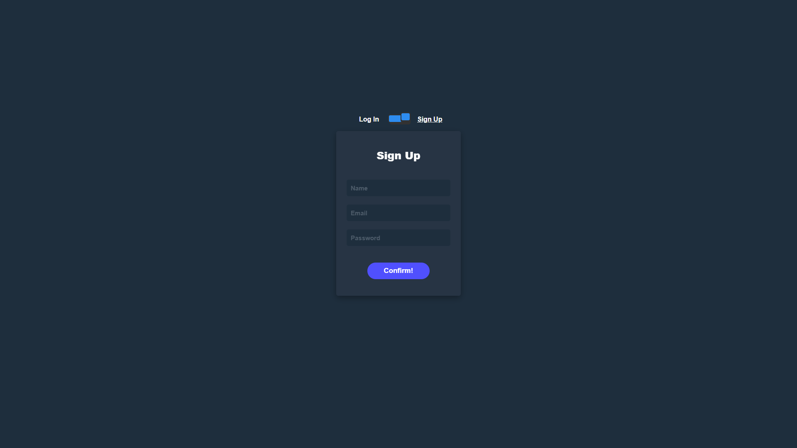

# 🔄 Switch Login

A clean and modern login form with toggle functionality between login and signup forms.  
Built with HTML, CSS, and JavaScript for smooth user experience and responsive design.

---

## 🚀 Live Demo

🌐 [View Live Demo](https://codebyabdo.github.io/switch-login/)

---

## 📸 Screenshot

 <!-- أضف صورة توضيحية إذا متوفرة -->
 <!-- أضف صورة توضيحية إذا متوفرة -->

---

## ✨ Features

- Toggle between Login and Signup forms  
- Smooth animations and transitions  
- Responsive design for all devices  
- Form validation with JavaScript

---

## 🛠 Tech Stack

- HTML5  
- CSS3  
- JavaScript (Vanilla)

---

## 📦 Getting Started

To run the project locally:

```bash
git clone https://github.com/abd-el-rahman-adel-dev/switch-login.git
cd switch-login
open index.html
```

Or just double-click `index.html` in your file manager.

---

## 📁 Project Structure

```
📦 switch-login
┣ 📂 css
┣ 📂 images
┣ 📜 index.html
┣ 📜 script.js
l
```

---

## 📄 License

This project is licensed under the [MIT License](./LICENSE).

---

## 🙋‍♂️ Author

- [Abd El-Rahman Adel](https://github.com/codebyabdo)
- [LinkedIn](https://www.linkedin.com/in/codebyabdo)

---

> ⭐ If you like this project, please consider starring the repository!
